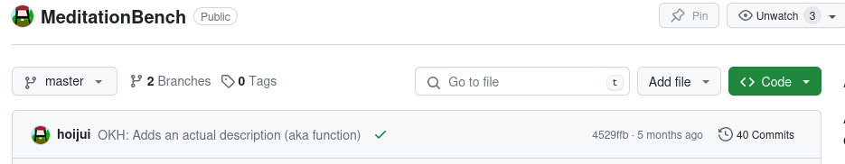
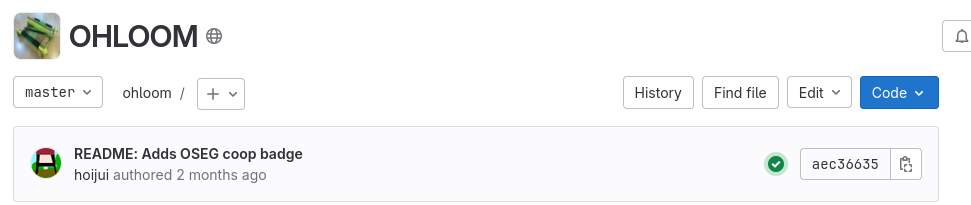

<!--
SPDX-FileCopyrightText: 2023 Robin Vobruba <hoijui.quaero@gmail.com>

SPDX-License-Identifier: CC0-1.0
-->

# `osh`-tool - How to use

There are essentially two ways to use this tool:

- **easy** - If your project is hosted in _on a git forge_
  that supports CI (e.g. GitHub, GitLab, ...),
  we recomend [integrating it through CI](#ci).
- advanced - [Running it _locally_](#cli).
  This needs some more fiddling,
  especially if you try it without docker.

## CI

CI stands for _Continuous Integration_, and basically means:
Running something on a build-bot (a type of server),
whenever you push commits (aka change something).
This is commonly used to compile a binary
from the software hosted in the git repo,
or as in our case,
to check the quality of whatever is inside the repo.

Depending on where you host your OSH projects git repo,
you need to set it up slightly differently:

- [GitHub](#github)
- [GitLab](#gitlab)

### GitHub

Make sure you have a directory structure like this in your repo:

```shell
.github/workflows/
```

for example, you can create it like this on linux:

```shell
mkdir -p .github/workflows/
```

_NOTE_ \
If you already have this directory with a file in there,
you will likely have to combine the following
with that file _in the right way_! \
Ask someone who knows about this.

Then create a new file in that directory with a name of your choice
and the extension `yml`,
for example `.github/workflows/osh_tool.yml`,
and fill it with this content (no editing required):

```yaml
name: Run osh-tool & deploy results to GH Pages

on:
  push:
    branches: [ master, main, develop ]
    # Allows you to run this workflow manually from the Actions tab
    workflow_dispatch:

# Sets permissions of the GITHUB_TOKEN to allow deployment to GitHub Pages
permissions:
  contents: read
  pages: write
  id-token: write

# Allow one concurrent deployment
concurrency:
  group: "pages"
  cancel-in-progress: true

jobs:
  build:
    name: Compile
    runs-on: ubuntu-latest
    steps:
      - name: "Check out the repo"
        uses: actions/checkout@v3
        with:
          submodules: true

      - name: Fix checkout ownership
        run: |
          # HACK Workaround for bug:
          # https://github.com/actions/runner/issues/2033
          mkdir -p /home/runner/work/_temp/_github_home
          printf "[safe]\n\tdirectory = /github/workspace" \
            > /home/runner/work/_temp/_github_home/.gitconfig

      - name: OSH-Tool Check/Linting
        id: osh-check
        uses: hoijui/osh-tool@master

      - name: Upload artifact
        uses: actions/upload-pages-artifact@v1
        with:
          path: "public/"

  # Deployment job
  deploy:
    environment:
      name: github-pages
      url: ${{ steps.deployment.outputs.page_url }}
    runs-on: ubuntu-latest
    needs: build
    steps:
      - name: Deploy to GitHub Pages
        id: deployment
        uses: actions/deploy-pages@v1
```

Commit and push this change,
and if all goes well, you should see this
on your repo page after a few minutes:



Now, your osh-tool report should be available at
(replace UPPER-CASE parts):

`https://USER_OR_ORGANIZATION.github.io/PROJECT/osh-report.html`

for example:

<https://hoijui.github.io/MeditationBench/osh-report.html>

Within the report, you can find the _Badges_ section (hidden by default).
From there, you can copy&paste code into your projects _README.md_,
which will give you a badge that shows the osh-tool checks percentage
achieved in the latest change of your project,
and clicking on the badge will bring the user to the fullly detailed report.

### GitLab

All happens in the file `.gitlab-ci.yml` in your repo.

_NOTE_ \
If you already have the file,
you will have to combine the following
with that file _in the right way_! \
Ask someone who knows about this.

Create the file `.gitlab-ci.yml` with the following content
(no editing required):

```yaml
image: hoijui/osh-tool:latest

pages:
  script:
  - report_gen --download-badges
  artifacts:
    paths:
    - public
```

Commit and push this change,
and if all goes well, you should see this
on your repo page after a few minutes:



Now, your osh-tool report should be available at
(replace UPPER-CASE parts):

`https://USER_OR_ORGANIZATION.gitlab.io/PROJECT/osh-report.html`

for example:

<https://osegermany.gitlab.io/ohloom/osh-report.html>

Within the report, you can find the _Badges_ section (hidden by default).
From there, you can copy&paste code into your projects _README.md_,
which will give you a badge that shows the osh-tool checks percentage
achieved in the latest change of your project,
and clicking on the badge will bring the user to the fullly detailed report.

## CLI

TODO

